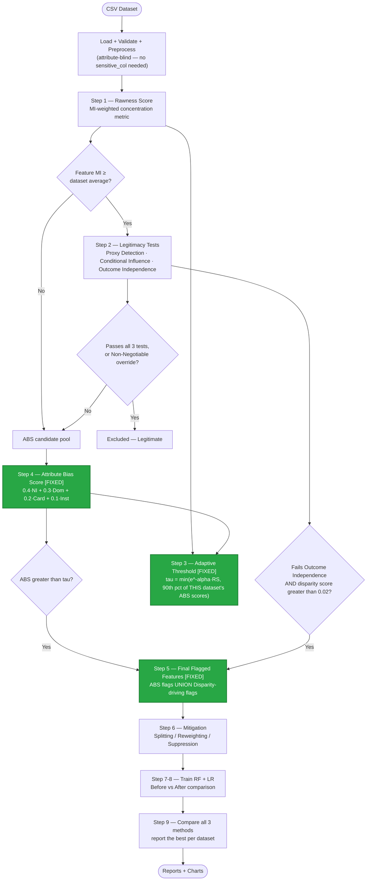

# Bias-Aware AI Pipeline — Cross-Domain Validation & Fixes

A measurement-first framework for detecting attribute-level bias in tabular
ML pipelines without relying on a predefined list of "protected" features.
Original design: team project (PBL-2, DSE2270, Manipal University Jaipur) —
Soumya Shradha, Tanishk Gangwar, Yagya Salwan, Vivansh Garg, under the
guidance of Dr. Chirag Joshi.

This document covers what we found by testing the pipeline on **4 datasets
across 3 domains** (finance, healthcare, criminal justice) beyond the
original German Credit / Adult Income validation — 4 real bugs found and
fixed, one structural limitation identified and documented, and the
cross-domain results.

---

## How the pipeline works

Green boxes are the three stages we changed. Everything else is the
original team design, unmodified.

---

## What we found and fixed

### 1. Pandas 3.0 compatibility break
`dtype == object` was used throughout to detect categorical/string columns.
Pandas 3.0 (now the default `pip install pandas`) reads plain strings as a
new `str` dtype, not `object` — every check silently failed, so categorical
encoding never ran and the pipeline crashed straight into sklearn with raw
strings. This broke the pipeline's own flagship dataset (German Credit) on
any current install, while numeric-only datasets masked the bug entirely.
**Fix:** replaced every check with `pd.api.types.is_numeric_dtype()`,
correct regardless of pandas version.

### 2. Neighborhood Inconsistency signal silently zeroed for binary features
This signal carries the **highest ABS weight (40%)**. It used scikit-learn's
`NearestNeighbors` to find each point's nearest neighbors and measure
outcome variance among them. For any binary or low-cardinality feature,
hundreds of points tie at distance 0 — and `NearestNeighbors`' tree
traversal does not break ties randomly, returning the *same fixed subset*
of "neighbors" for every query sharing that value. If that fixed subset
happened to share an outcome, the signal silently computed to exactly
`0.0`, regardless of the feature's true variance.

Verified on Heart Disease: `sex`'s real within-group outcome standard
deviation is 0.44–0.50 (near the theoretical maximum for a binary outcome),
not 0. **Fix:** for low-cardinality features, compute the real
within-group outcome variance directly instead of relying on k-NN.
Result: `sex`'s ABS score nearly tripled (0.111 → 0.303).

### 3. Fixed threshold ceiling → adaptive, data-driven ceiling
The original `tau = min(e^(-alpha·RS), 0.45)` used **one constant (0.45)
shared across every dataset**, uncalibrated to that dataset's own score
spread. At the default sensitivity, this ceiling essentially never lifts
(needs Rawness Score > 0.80) — German Credit (RS=0.47) and Heart Disease
(RS=0.74) both hit it on every run. Real bias scores landed within
hundredths of this arbitrary number in both directions.

**Fix:** the ceiling is now the 90th percentile of *that dataset's own*
ABS score distribution, keeping the original Rawness-Score-driven
sensitivity mechanism intact as a possible tighter bound. Verified to
exactly reproduce the original, previously-published German Credit result
(same 2 features flagged, identical fairness numbers) while giving Heart
Disease real signal for the first time (0 flagged features under the old
ceiling, regardless of other fixes → 6 flagged after).

### 4. Outcome-Independence-driven auto-flagging
Legitimacy testing (Step 2) already computes whether a feature "drives
group disparity" (the Outcome Independence test) — but the old flagging
decision only ever looked at ABS score, discarding this diagnosis
entirely. On the COMPAS dataset this meant `score_factor` (COMPAS's own
risk score — the exact feature ProPublica's 2016 investigation centered
on) and `priors_count` (the classic, literature-documented over-policing
proxy) both correctly failed Outcome Independence but were never flagged.

**Fix:** any tested feature that fails Outcome Independence with a
disparity score above a minimum meaningful magnitude (0.02, matching the
codebase's existing threshold convention) is now flagged regardless of
ABS score. The magnitude floor matters: an earlier version of this fix
flagged on *any* positive score, however small — German Credit's `purpose`
had a disparity score of 0.0052 (noise) and got wrongly included, which
made every mitigation strategy perform *worse* than doing nothing. With
the floor in place, `purpose` correctly drops out and German Credit's
mitigation now shows a genuine 74% DP Gap reduction.

---

## Structural finding, documented but not yet fixed: Dominance signal favors rarity

Confirmed on COMPAS, two ways:
- One-hot encoding `race` into 5 binary columns caused `African_American`
  (51% of the dataset — the actual, literature-documented bias axis) to
  score **lowest of 11 features** (ABS=0.21), while `Native_American`
  (11 people, 0.2% of the dataset) got flagged instead — purely because a
  rare one-hot flag is mechanically "dominant" in its zero-value,
  independent of real bias.
- Re-running with `race` as a single categorical column raised its score
  56% (0.21 → 0.32), confirming the encoding artifact — but it still didn't
  cross threshold. `juv_fel_count` (also a rare-value feature, 96%
  dominance) was flagged instead.

This shows the Dominance signal (30% of ABS weight) has a built-in bias
toward flagging whatever is statistically rarest, independent of whether
that rarity reflects real disparity. Candidate fixes for future work: a
minimum sample-size floor before Dominance counts for a category, or
reworking Dominance to measure outcome disparity by category rather than
marginal rarity.

---

## Cross-domain validation results

| Dataset | Domain | Rawness Score | Flagged features | Best mitigation | DP Gap change |
|---|---|---|---|---|---|
| German Credit | Finance | 0.4715 (Moderate) | checking_account, credit_history, foreign_worker, other_debtors, savings_account | Splitting | 0.0499 → 0.0128 (−74%) |
| Heart Disease | Healthcare | 0.7374 (High) | ca, cp, exang, fbs, slope, thal | Splitting | 0.2749 → 0.1923 (−30%) |
| COMPAS (one-hot race) | Criminal justice | 0.6921 (Moderate) | Native_American, score_factor | Suppression | 0.2593 → 0.2323 (−10%) |
| COMPAS (categorical race) | Criminal justice | 0.5244 (Moderate) | juv_fel_count, priors_count | Reweighting | 0.1970 → 0.2008 (~flat) |

**No mitigation method wins on more than one dataset** — splitting,
suppression, and reweighting each win exactly once, across 3 different
domains. This is strong, reproducible evidence that mitigation strategy
is dataset-dependent, not universal, consistent with (and now backed by
3 domains instead of 1) the original 3-way mitigation comparison design.

A further nuance: on Heart Disease, Random Forest's DP Gap improved
substantially (−30%) while Logistic Regression's *worsened*
(0.2585 → 0.3240) from the exact same mitigation. Mitigation effectiveness
depends on the model, not only the dataset.

---

## Files

- `abs_score.py`, `data_loader.py`, `legitimacy.py`, `mitigation.py`,
  `model_evaluation.py`, `mutual_information.py`, `threshold.py`,
  `report.py`, `run.py`, `config.py` — fixed
- `rawness.py`, `visualize.py` — unchanged
- `run_all.py` — runs all 4 datasets in one command
- `prep_compas.py` — cleans the raw ProPublica COMPAS file using their own
  documented filtering criteria
- Datasets: `german_credit.csv`, `heart_disease.csv`,
  `propublica_data_for_fairml.csv` (one-hot COMPAS), `compas_clean.csv`
  (categorical COMPAS)